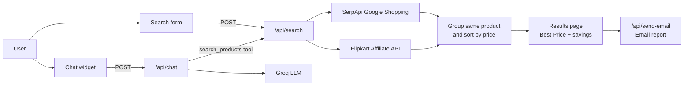

<div align="center">

# 🛒 AI Deal Finder

**Search once. Compare prices across Indian shopping sites. Buy the cheapest.**

Type a product name and get a side-by-side price comparison from Amazon.in, Flipkart, Meesho, Croma and Reliance Digital, plus an AI shopping assistant that answers your buying questions in English, Hindi or Hinglish.


</div>

---

## 📖 Table of Contents

- [About](#-about)
- [Features](#-features)
- [Screenshots](#-screenshots)
- [Tech Stack](#-tech-stack)
- [How It Works](#-how-it-works)
- [Getting Started](#-getting-started)
- [Environment Variables](#-environment-variables)
- [AI Shopping Assistant](#-ai-shopping-assistant)
- [API Reference](#-api-reference)
- [Project Structure](#-project-structure)
- [Deployment](#-deployment)
- [Known Limitations](#-known-limitations)
- [Roadmap](#-roadmap)
- [Contributing](#-contributing)
- [Author](#-author)
- [Disclaimer](#-disclaimer)

---

## 📌 About

The same phone or pair of shoes is often listed on several shopping sites at different prices. Finding the cheapest one means opening every site and searching again and again.

**AI Deal Finder** does that work for you. Enter a product (for example `iPhone 15` or `Nike Air Jordan 4`), a budget, your location and how urgently you need it. The app fetches prices on the server, matches listings of the *same product variant*, sorts the sellers from cheapest to costliest, highlights the best deal and shows how much you save. Every seller has a button that opens the seller's own page.

---

## ✨ Features

| | Feature | Details |
|---|---|---|
| 🔍 | **One search, many platforms** | Amazon.in, Flipkart, Meesho, Croma and Reliance Digital on a single results page |
| 🧩 | **Same-product matching** | Listings are grouped by product variant (title words + storage such as `128 GB`), so you compare like with like |
| 🏆 | **Best Price badge** | Sellers are sorted by price and the cheapest gets a "Best Price" badge |
| 💰 | **Savings summary** | Four cards: lowest price, max savings, top rating and number of platforms |
| 🔗 | **Direct seller links** | "View on Amazon / Flipkart / ..." opens the seller's page in a new tab |
| 📧 | **Email report** | Send the comparison to your inbox (Gmail + Nodemailer) |
| 🤖 | **AI shopping assistant** | Chat widget powered by Groq with live price lookup; replies in English, Hindi or Hinglish |
| ⚡ | **Quick search chips** | One-click searches: iPhone 15, Nike shoes, boAt earbuds, Samsung TV |
| ⏳ | **Progress screen** | Step-by-step progress while prices are being compared |
| 🌗 | **Light and dark mode** | Theme toggle in the header |
| 📱 | **Responsive UI** | Works on desktop and mobile |
| 🧪 | **Demo mode** | No API key? The app falls back to sample data and shows a dismissible "Demo prices" notice |
| 🔐 | **Keys stay on the server** | All API calls are made from Next.js API routes, never from the browser |

---

## 🖼️ Screenshots

> Add your screenshots to a `docs/screenshots/` folder and update the paths below.

| Home | Results |
|---|---|
|  |  |

| Dark mode | AI assistant |
|---|---|
|  |  |

---

## 🧰 Tech Stack

| Area | Tools |
|---|---|
| Framework | [Next.js 15](https://nextjs.org) (App Router), [React 19](https://react.dev) |
| Language | JavaScript (JSX) |
| Styling | [Tailwind CSS](https://tailwindcss.com), Radix UI based components in `components/ui` |
| Icons and theme | [lucide-react](https://lucide.dev), [next-themes](https://github.com/pacocoursey/next-themes) |
| Price data | [SerpApi](https://serpapi.com) (Google Shopping), optional [Flipkart Affiliate API](https://affiliate.flipkart.com) |
| AI assistant | [Groq API](https://console.groq.com) (`openai/gpt-oss-120b` with `openai/gpt-oss-20b` as fallback) |
| Email | [Nodemailer](https://nodemailer.com) with Gmail |

---

## 🧠 How It Works



1. The user enters a product, budget, location and urgency, then clicks **Compare Prices**.
2. The browser calls the app's own route `/api/search`.
3. The server queries SerpApi and (if configured) the Flipkart Affiliate API **in parallel**. If one source fails, the other still works.
4. Duplicate listings are removed. Each listing's platform is detected from the seller name (Amazon, Flipkart, Meesho, Croma, Reliance/JioMart, otherwise Google Shopping).
5. Listings are **grouped by product variant** using a normalised key (first words of the title plus storage), then sorted by price.
6. The best price, best platform, maximum savings and price difference are calculated.
7. The results page shows the product card, summary cards and one row per seller with a link to the seller's page.

If no API key is set, step 3 returns demo data instead. If keys are set but nothing is found, the app returns direct search links to Amazon.in, Flipkart and Meesho.

---

## 🚀 Getting Started

### Prerequisites

- [Node.js](https://nodejs.org) **18.18 or newer**
- A free [SerpApi](https://serpapi.com/users/sign_up) account for live prices (the free plan includes 250 searches per month)
- Optional: a [Groq](https://console.groq.com) API key for the assistant, and a Gmail account with an [App Password](https://support.google.com/accounts/answer/185833) for email reports

> You can run the app with **no keys at all**. It will start in demo mode.

### 1. Clone and install

```bash
git clone https://github.com/Affan-khan-oss/Ai-Deal-Finder.git
cd Ai-Deal-Finder
npm install
```

### 2. Create `.env.local`

Create a file named `.env.local` in the project root and paste this:

```env
# --- Live prices (https://serpapi.com/users/sign_up) ---
SERPAPI_KEY=your_serpapi_key_here

# --- AI shopping assistant (https://console.groq.com) ---
GROQ_API_KEY=your_groq_key_here
# GROQ_MODEL=openai/gpt-oss-120b
# GROQ_FALLBACK_MODEL=openai/gpt-oss-20b

# --- Email report (Gmail + App Password) ---
GMAIL_USER=your_email@gmail.com
GMAIL_APP_PASSWORD=your_16_character_app_password

# --- Optional ---
FLIPKART_AFFILIATE_ID=
FLIPKART_TOKEN=
AMAZON_TAG=
```

> ⚠️ Never commit `.env.local`. It is already ignored by `.gitignore`. Keep your keys private.

### 3. Run the app

```bash
npm run dev
```

Open [http://localhost:3000](http://localhost:3000).

> Restart the dev server after changing `.env.local`.

### Other scripts

| Command | What it does |
|---|---|
| `npm run dev` | Start the development server |
| `npm run build` | Create a production build |
| `npm start` | Run the production build |
| `npm run lint` | Run the linter |

### Quick test without the UI

Open this in your browser to check the search route and see whether your keys were detected:

```
http://localhost:3000/api/search?q=iPhone+15
```

The response shows `live`, `demo`, `hasSerpApiKey` and a hint.

---

## 🔑 Environment Variables

| Variable | Required | Purpose |
|---|---|---|
| `SERPAPI_KEY` | For live prices | Google Shopping results through SerpApi. Without it (and without Flipkart keys) the app uses demo data |
| `FLIPKART_AFFILIATE_ID` | No | Flipkart Affiliate API ID (use together with `FLIPKART_TOKEN`) |
| `FLIPKART_TOKEN` | No | Flipkart Affiliate API token |
| `AMAZON_TAG` | No | Your Amazon Associates tag added to Amazon links. **If unset, the code falls back to a placeholder tag (`dealfinder-21`), so set your own** |
| `GROQ_API_KEY` | For the assistant | Without it the chat replies that it is not configured |
| `GROQ_MODEL` | No | Main model. Default `openai/gpt-oss-120b` |
| `GROQ_FALLBACK_MODEL` | No | Used if the main model is busy or fails. Default `openai/gpt-oss-20b` |
| `GMAIL_USER` | For email report | Gmail address used to send reports |
| `GMAIL_APP_PASSWORD` | For email report | 16-character Gmail App Password (needs 2-step verification) |

---

## 🤖 AI Shopping Assistant

Open it from the chat button on the home page. Try:

- *Best phone under ₹25,000?*
- *Compare iPhone 15 vs Galaxy S24*
- *Best Gaming Chair Under 7000*

How it works:

- The assistant is limited to **shopping and product questions** and politely refuses anything else.
- For any price question it calls a `search_products` tool, which runs the same `/api/search` as the main app. It is told to quote **only prices returned by the tool**.
- It replies in the language you write in (English, Hindi or Hinglish).
- If the data is demo data, it says so.

Built-in protection for your free-plan limits:

| Protection | Value |
|---|---|
| Search cache | 1 hour (in memory) |
| Searches per message | at most 2 |
| Rate limit | 15 chat requests per IP every 10 minutes |
| Model fallback | switches to the fallback model on rate limit or server error |

---

## 🔌 API Reference

| Route | Method | Description |
|---|---|---|
| `/api/search` | `POST` | Body: `{ product, maxPrice, location, urgency, sessionId }`. Returns `deals`, `comparedProducts`, `insights`, `live` and `demo` |
| `/api/search?q=...&maxPrice=...` | `GET` | Quick test helper that shows key status and a sample of the groups |
| `/api/chat` | `POST` | Body: `{ messages: [{ role, content }] }`. Returns `{ reply }` |
| `/api/send-email` | `POST` | Body: `{ email, sessionId, results }`. Sends the comparison report |
| `/api/test` | `GET` | Simple route to check that the server is running |

---

## 📁 Project Structure

```
Ai-Deal-Finder/
├── app/
│   ├── api/
│   │   ├── search/        # Price comparison route (SerpApi, Flipkart, demo data)
│   │   ├── chat/          # AI assistant route (Groq + search_products tool)
│   │   ├── send-email/    # Email report route (Nodemailer)
│   │   └── test/          # Health-check route
│   ├── layout.jsx
│   ├── loading.jsx
│   ├── page.jsx           # Switches between search, progress and results
│   └── globals.css
├── components/
│   ├── ui/                # Button, Card, Badge, Input, Select, ...
│   ├── search-form.jsx
│   ├── progress-section.jsx
│   ├── results-section.jsx
│   ├── chat-widget.jsx
│   └── theme-provider.jsx
├── hooks/                 # use-toast, use-mobile
├── lib/
│   ├── platforms.js       # Fetching, platform detection, grouping, sorting, demo data
│   └── utils.js
├── public/                # Static assets
├── styles/
└── package.json
```

---

## ☁️ Deployment

The easiest way is [Vercel](https://vercel.com):

1. Push the repository to GitHub.
2. Import it in Vercel.
3. Add the environment variables from the table above in **Project Settings → Environment Variables**.
4. Deploy.

> The chat cache and rate limiter live in server memory. On serverless hosting they reset between cold starts and are not shared across instances. For heavier use, move them to a shared store such as Redis.

---

## ⚠️ Known Limitations

- **Each search uses SerpApi credits.** Results are cached for 6 hours, but use searches wisely on the free plan.
- **Not every seller appears for every product.** If a seller is missing from Google Shopping data, it will not show up. Meesho, Croma and Reliance Digital have no public price API and are covered only through SerpApi.
- **Prices can differ slightly** from the live seller page because they come from search data.
- **MRP is estimated** for SerpApi results (selling price × 1.12), so the displayed discount for those results is approximate.
- **Variant matching is a heuristic** based on title words and storage. Different titles for the same product can fail to match.
- No database, login or price history yet.

---

## 🗺️ Roadmap

- [ ] More sellers (Myntra, Ajio, Nykaa, Tata CLiQ)
- [ ] Price history and price-drop alerts
- [ ] Save favourite products
- [ ] Better variant matching across platforms
- [ ] Shared cache and rate limiting (Redis)
- [ ] Deploy a live demo on Vercel

---

## 🤝 Contributing

Contributions are welcome.

1. Fork the repository
2. Create a branch: `git checkout -b feature/your-feature`
3. Commit your changes: `git commit -m "Add your feature"`
4. Push the branch: `git push origin feature/your-feature`
5. Open a Pull Request

---

## 👤 Author

**Affan Khan**
GitHub: [@Affan-khan-oss](https://github.com/Affan-khan-oss)

---

## 📄 License

This project is open for learning and personal use. Add a `LICENSE` file (for example MIT) if you want others to reuse it.

---

## 📢 Disclaimer

This project is not affiliated with Amazon, Flipkart, Meesho, Croma, Reliance Digital, SerpApi or Groq. All product names and logos belong to their respective owners.
